# Week 1: Recurrent Neural Network Model
1. Why sequence models
2. Notation
3. Recurrent Neural Network (RNN) Model
4. Backpropagation through time (BPTT)
5. Different types of RNNs
6. Language model and sequence generation
7. Sampling novel sequences
8. Vanishing gradients with RNNs
9. Gated Recurrent Unit (GRU)
10. Long Short term Memory (LSTM)
11. Bidirectional RNN
12. Deep RNNs
## 1. Examples of sequential data

## 2. Notation
#### Input sequence
- 
Represents the t'th element (word) of the input sequence

-  This represents the t'th element of the i'th input sequence (i.e. i is a training example/row)
  
-  This represents the lenght of the i'th training set example
  
#### Output sequence
-  Same as above

#### Dictionary
-  A dictionary is a set of words used for one-hot encoding input elements. It's basically a list of n number of words, each with their own index.

- This dictionary is used to one-hot encode input elements as shown below 

- So xt is not the word itself but rather the vector representation of that word (representation could be made using one-hot encoding or some other way)

## 3. Recurrent Neural Network Model
#### Why not use a standard network?
- We can use a standard network as given below, but it wouldn't work well (problems also given in picture): 
- Using RNNs will also allow you to reduce the number of parameters since input sizes are huge
#### Vizualising an RNN
- Each network, besides getting the word vector as input, also gets the activation of the previous time step (i.e. the activation produced by the previous input vector) as input: 
- a0 is a vector of 0s/randomly generated vector that's used as the input for an imaginary timestep 0. Also in the above example, Tx = Ty.
- Another common representation of an RNN is as: , where the coloured box means that a timestep has passed.
- RNNs go through the data from left to right and the parameters (weights) are shared (Wxa, Waa, Wya) (i.e. they're the same for all timesteps).
- Weakness: only information from earlier inputs (of that sequence) can be used when producing y-hat for a given input. This is a problem in cases like: . Teddy represents a president in the first sentance but a toy in the next. It would be useful to get the president/bear word vector as input before getting "Teddy" (possible with Bidirectional RNNs - BRNNs - will be elaborated later).
#### Forward Propagation
- Equations: 
- tanh is most commonly used as activation for hidden nodes. For output node, sigmoid is commonly used for binary classification tasks (like named-entity recognition), SoftMax for k-way classification problem, etc

#### Simplified RNN notation

- We convert the a<t> equation from: 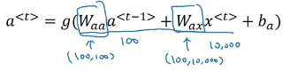 to 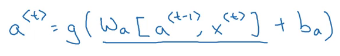, where Wa is given by  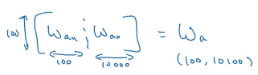 and [a<t-1>, x<t>] is given by 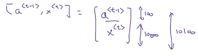.
- Wa * [a<t-1>, x<t>] just gives back the original equation: 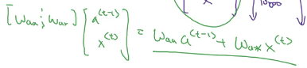.
- Advantage of doing this is merely notation simplification.
- Similarly, the y-hat notation is simplified as: 

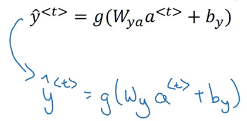.

## 4. BPTT

- Loss of a single output neuron:  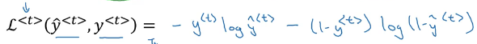
- Overall Loss equation (just a summation):  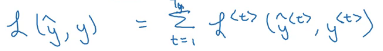
- Loss calculation visualization: 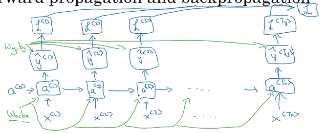
- BPTT (red arrows): 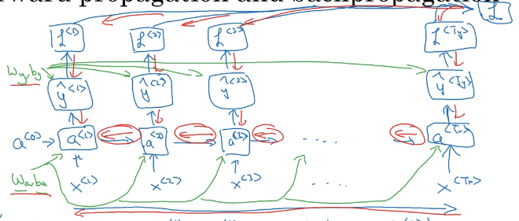

## 5. Different types of RNNs

- Tx and Ty can be different
- **Many-to-many** architecture: -
  - Tx == Ty: 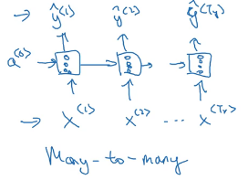
  - Tx != Ty: 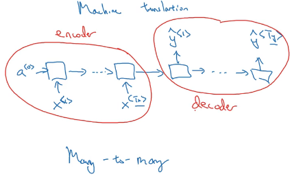. Example here is machine translation, where the entire input is taken in first (by the <u>encoder</u>) and only then is the output generated (by the <u>decoder</u>).
- **Many-to-one** architecture: 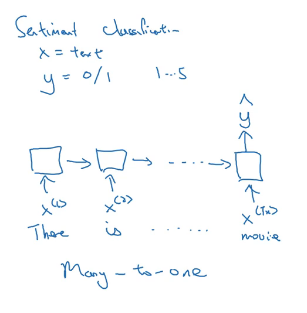. Example here is a sentiment analyzer where input is movie review and output is either binary (good or bad) or a rating from 1-5.
- **One-to-many** architecture: 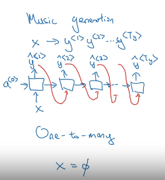. Example here is a music generator, where input is a random integer/genre of music/first note to begin with/null input and output is a bunch of notes in sequence. 
- **Attention based** architecture: will be explored later
- Summary: 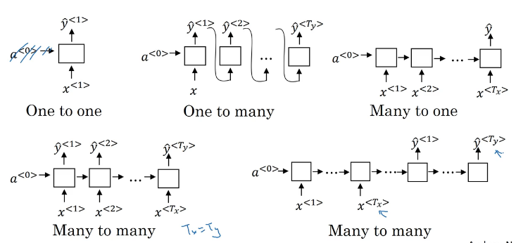

## 6. Language model and sequence generation

#### Defining a Language model

- If a speech recognition system hears a sentence and has to decide which one it heard: 

  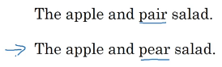, then it relies on its internal **language model**, which gives it probabilities of the sentence being one or the other: 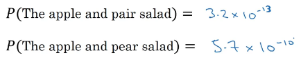

- So, a language model tells you that if you pick a sentence (from anywhere), then it outputs  the prior probably of that particular sequence of words popping up one after the other, thus giving you the probability of whether that sentence was correctly identified or not (for example in the previous point, the "pair" sentence has a lesser chance of popping up in an English corpus than the "pear" sentence. So if there is any confusion, its safer to go with the "pear" sentence):  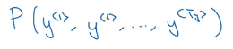

#### Building a Language model

- **Training set**: large corpus of English text
- Steps: -
  - **Step 1 - Tokenize**: We tokenize each input word (use one-hot vector which represents the index of the input word in our pre-defined library) (we can also add a <EOS> i.e. "End Of Sentence" token, will be explained later) (tokenizing the punctuation mark is optional): 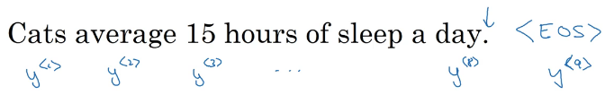. If a word doesn't exist in your vocabulary, it is replaces with a <UNK> token ("Unknown") (model will learn that chance of the "unknown" word is the specific word "Mau"): 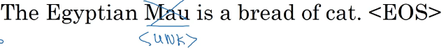
  - **Step 2 - Build the RNN model:**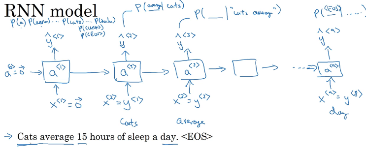 At each timestep, the input is the correct t-1 th word, and the output is softmax probability of the next word being the actual word given the sentence so far (denominator is sum of e^activations of all words in the dictionary). Individual loss: 

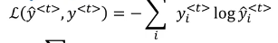. Overall loss: 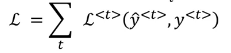

- This RNN model is our required the language model. Given a sentence, it can tell you the probability of that sentence occurring like so: 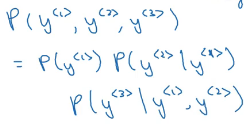

#### Character level language model

- The vocabulary is a set of characters instead of words, and the model predicts the likely hood of the next character and not the word: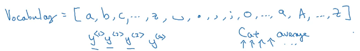. <u>Advantage</u>: no need for <unk> tokens, characters will always be within ASCII list. <u>Disadvantage</u>: You will end up with very long sequences, more computationally expensive, can't learn long range dependencies within a sentence very easily

## 7. Sampling novel sequences

- Suppose you have a trained RNN language model like so: 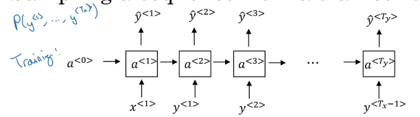
- You can use this model to sample a unique sequence of words. To do this, we first enter a zero vector as x1 and another zero vector as a0, and the output we get is the probability distribution of y1 being a given word in the dictionary (not just the next word like previously, because there is no "next word"): 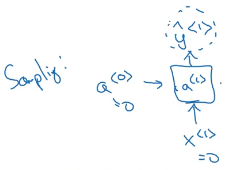.  Whichever word had the highest probability is chosen.
- In the next time step, you give that chosen word y1-hat as input (instead of actual y1 because there is no "actual y1"): 
- You keep going on like this until you get to the last time step. Ways to find the last time step: -
  - If <EOS> was a part of your training vocab, then you  can just keep sampling until <EOS> is chosen
  - Just set a limit to the number of timesteps

## 8. Vanishing gradients with RNNs

- Words that come much earlier in a sentence can affect words that come much later (leading to very long term dependencies): 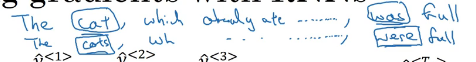
- Basic RNNs aren't very good at recognizing long term dependencies due to [vanishing gradients](<https://www.superdatascience.com/blogs/recurrent-neural-networks-rnn-the-vanishing-gradient-problem/>)
- Exploding gradients are also a problem but easier to spot because the parameters start getting so large they turn into NaNs. Solution: gradient clipping (if gradient starts increasing over a certain value, then clip them to some maximum number)

## 9. Gated Recurrent Unit (GRU)

#### RNN

- A basic RNN unit representation: 

#### Simplified GRU

- The GRU has another variable called "c", which denotes the cell memory. This variable is infact to the activation value of the unit at time t but is denoted with a different variable here (in LSTM these values will differ): 
- At every time step, we compute ct-tilde, which will be a candidate for replacing the current value of ct: 
- Then we have a gate (represented here by Captial gamma subscript u, where u stands for update gate) which is a value between 0 and 1 (the small sigma function denotes the sigmoid funtion): 
- This gate is used to calculate the new ct as follows: 
- Since the gate is calculated using a sigmoid function, it will usually be very close to 0 or 1. If gate almost = 0, then ct almost = ct-1 and hence the memory cell value is retained (almost). However, if gate almost = 1, then ct almost = ct-tidle, and hence the ct value is changed
- Simplified GRU unit representation (the purple box represents the ct update operation defined by the equation just above): 
- Since the gate value is usually very close to 0, the ct value is usually retained across many timesteps. Moreover GRUs don't suffer from the vanishing gradient problem. Thus, they can learn very long range dependencies

- ct will be a vector of the same dimension as the activation value (and thus ct-tilde and gamma as well) => gamma is a n-dimensional vector of values between 0-1 => gamma updates ct element wise (some elements might get updated and some might not, thus ct is a mix ct-tilde and ct-1, and not absolutely one of the two). Since there are multiple elements, each element (or combination of elements) can be used to remember different information (eg: is the word in memory singular or plural, etc.)

#### Full GRU

- Here we introduce another gate gamma-r (with r standing for "relevance") to the calculation of ct-tilde. The new set of equations is: 
- This gamma-r version of the GRU is most commonly used as experimentally it gives the best results

## 10. Long Short term Memory (LSTM)

- Usually more powerful than GRUs. However different models work better on different problems. LSTMs require more computational power as there are more gates (and weight parameters) to be learnt, so GRU can be used bigger models
- GRUs were actually invented after LSTMs! As a simplification
- *When in doubt, use **LSTM***
- LSTM is a more general version of the GRU
- Equation set: 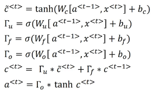
- Equation differences (from GRU equations): - 
  - ct != at
  - ct-tilde uses at-1 instead of ct-1
  - Instead of using gamma-u and 1 - (gamma-u) in the calculation of ct, we use gamm-u and gamma-f (f for "forget"). This gives the LSTM the option to add/subtract elements of ct-tilde and ct-1 instead of deciding between one of the two (or something in between)
  - gamma-o (o for "output") is new here, used for at calculation
- Revising the gate meanings: -
  - gamma-u = update gate
  - gamma-f = forget gate
  - gamma-o = output gate
- LSTM representation (circle-* -> element-wise multiplication of vectors): 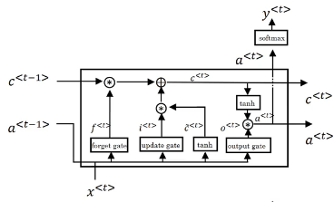

- Modification: peephole connection: 

## 11. Bidirectional RNN

- 

