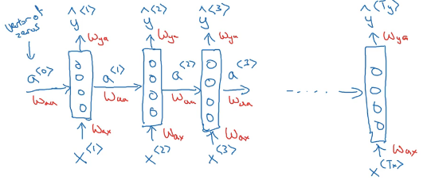

# Week 1: Recurrent Neural Network Model
1. Why sequence models
2. Notation
3. Recurrent Neural Network (RNN) Model
4. Backpropagation through time (BPTT)
5. Different types of RNNs
6. Language model and sequence generation
7. Vanishing gradients with RNNs
8. Gated Recurrent Unit (GRU)
9. Long Short term Memory (LSTM)
10. Bidirectional RNN
11. Deep RNNs
## 1. Examples of sequential data

## 2. Notation
#### Input sequence
- 
Represents the t'th element (word) of the input sequence

-  This represents the t'th element of the i'th input sequence (i.e. i is a training example/row)
  
-  This represents the lenght of the i'th training set example
  
#### Output sequence
-  Same as above

#### Dictionary
-  A dictionary is a set of words used for one-hot encoding input elements. It's basically a list of n number of words, each with their own index.

- This dictionary is used to one-hot encode input elements as shown below 

- So xt is not the word itself but rather the vector representation of that word (representation could be made using one-hot encoding or some other way)

## 3. Recurrent Neural Network Model
#### Why not use a standard network?
- We can use a standard network as given below, but it wouldn't work well (problems also given in picture): 
- Using RNNs will also allow you to reduce the number of parameters since input sizes are huge
#### Vizualising an RNN
- Each network, besides getting the word vector as input, also gets the activation of the previous time step (i.e. the activation produced by the previous input vector) as input: 
- a0 is a vector of 0s/randomly generated vector that's used as the input for an imaginary timestep 0. Also in the above example, Tx = Ty.
- Another common representation of an RNN is as: , where the coloured box means that a timestep has passed.
- RNNs go through the data from left to right and the parameters (weights) are shared (Wxa, Waa, Wya) (i.e. they're the same for all timesteps).
- Weakness: only information from earlier inputs (of that sequence) can be used when producing y-hat for a given input. This is a problem in cases like: . Teddy represents a president in the first sentance but a toy in the next. It would be useful to get the president/bear word vector as input before getting "Teddy" (possible with Bidirectional RNNs - BRNNs - will be elaborated later).
#### Forward Propagation
- Equations: 
- tanh is most commonly used as activation for hidden nodes. For output node, sigmoid is commonly used for binary classification tasks (like named-entity recognition), SoftMax for k-way classification problem and 